## Linux Fundamentals for Data Engineering
*A hands-on walkthrough of server access, user management, PostgreSQL setup, and essential Linux commands*
## Introduction
One of the most important skills for someone new to data engineering is learning how to interact with Linux servers. Whether it's cloud servers, databases, or data pipelines, most data infrastructure is running on Linux. Navigating a Linux environment is no longer an option for data engineers, but a prerequisite skill they must master if they are to succeed (Byrone_Code, 2026). 

In this article, I will take you through what I did in the hands-on assignment, where I had to connect to a remote server, install PostgreSQL, make a database and execute some basic Linux commands. For every step, I will clarify its meaning and importance in data engineering. You will have a firm grasp of the basics of Linux that you can use in your own data engineering journey by the end of this article.

## 1. Connecting to a Remote Server Using SSH
The most important thing any data engineer should learn is how to connect to a remote server. More realistically, we are not processing jobs on our laptop, or running pipelines, or storing data on a local database. The program used to log on to these servers is called Secure Shell or SSH. SSH provides a secure login to a remote system and the ability to control the system using the command line. The basic syntax is:

```bash
ssh username@server_ip_address
```
In my case, I had to log on to the assignment server as follows:
```bash
ssh root@159.65.222.96
```
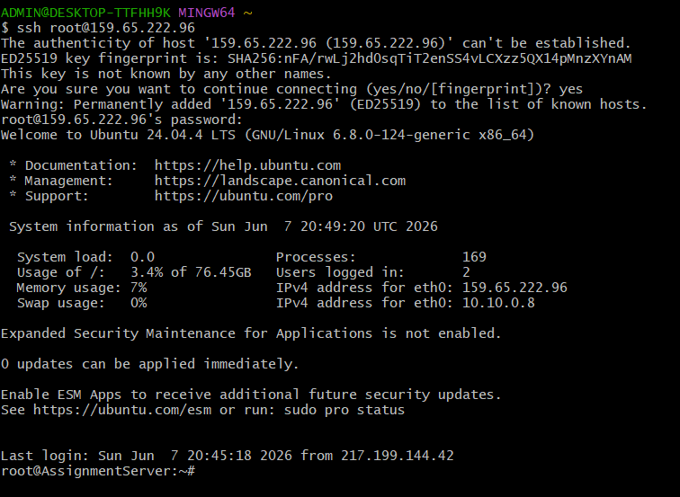

The server will prompt you to accept the server's identity when you're connecting for the first time by displaying a fingerprint. Press yes to proceed. Then, you key in your password and you're in.

After logging in, you will be able to view important information regarding the server like Operating System version, memory usage, how long it has been running, and how many users are logged in. For my example, I'm using Ubuntu 24.04.4 LTS, one of the most common Linux distributions for data engineering. 

Being able to understand SSH is essential as a data engineer, since you will be connecting to cloud servers on AWS, Google Cloud, Azure, or DigitalOcean and managing databases, running scripts, and deploying pipelines.

## 2. Creating a Linux User Account
Creating user accounts is one of the first things you will do as an administrator in a server. Within an actual company, every user requiring access to a server is assigned a user account. This is important for security; you never want everyone sharing the root account. 

The user creation command in Linux is called adduser:
```bash
adduser herman
```
Linux will guide you through setting the password and entering some basic user information. After this, you can check to see if the user was created successfully, as follows:
```bash
id herman
cat /etc/passwd | grep herman
```
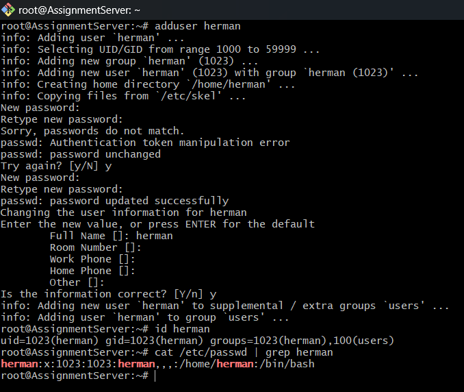

The id command displays the user ID (UID), group ID (GID) and the user's groups. All the basic information about all the users on the system is stored in the /etc/passwd file. Something I found out during this step is that the Linux username needs to be in lower case. 

I attempted adduser HermanO and Linux refused to add the user, stating that the name was not in the correct format. Converting to lowercase solved the problem right away.

## 3. Setting Up PostgreSQL
PostgreSQL is one of the most popular relational databases for data engineering. It's open source, robust, and offers advanced capabilities such as JSON storage, partitioning, and complex queries. Many modern data stacks use PostgreSQL as their primary database.

### Checking if PostgreSQL is Installed
Before installing anything, always check if it is already there:

```bash
psql --version
```

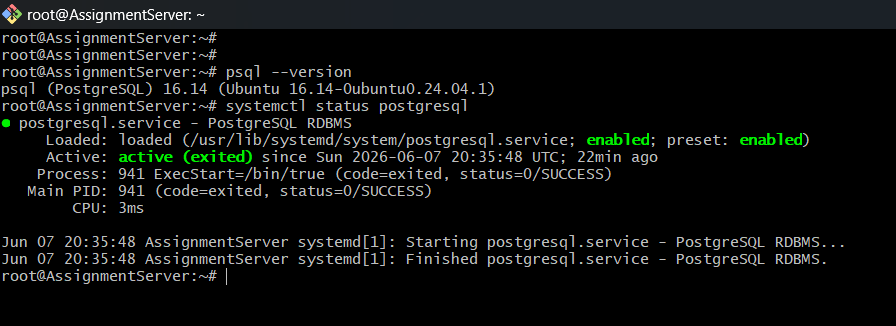

In my case, PostgreSQL 16.14 was already installed. I then checked if the service 
was running:

```bash
systemctl status postgresql
```

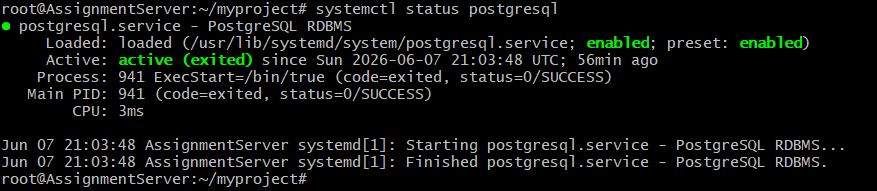

The service was active and enabled, meaning it starts automatically every time the server reboots.

### Allowing External Connections
PostgreSQL by default only allows connections from the same machine that it is installed on. Data Engineering tasks frequently require access to PostgreSQL from other applications such as DBeaver, TablePlus, or from Python code on a remote host. To allow external connections, you need to edit two configuration files:

**postgresql.conf** - change `listen_addresses = 'localhost'` to `listen_addresses = '*'`

**pg_hba.conf** - add a line to allow connections from any IP:

host all all 0.0.0.0/0 md5

Then open the firewall port:

```bash
ufw allow 5432/tcp
```
This is a skill every data engineer needs, configuring databases to be accessible from data visualization tools, ETL pipelines, and analytics platforms.

## 4. Creating a Database and Staging Schema
Once PostgreSQL was up and running, the next part of the process was creating the database and establishing a staging schema. The staging schema is the place where raw data is deposited prior to cleaning and transformation in data engineering. It's a standard practice in data warehousing and ETL processes.

### Creating the Database

```bash
su - postgres
psql
```

Inside psql:

```sql
CREATE DATABASE herman;
\c herman
```

### Creating the Staging Schema

```sql
CREATE SCHEMA staging;
\dn
```

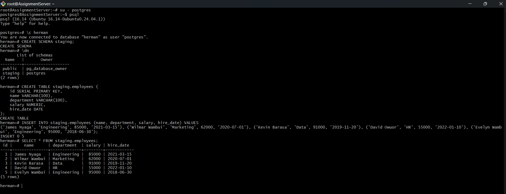

### Creating a Table and Inserting Data

```sql
CREATE TABLE staging.employees (
    id SERIAL PRIMARY KEY,
    name VARCHAR(100),
    department VARCHAR(100),
    salary NUMERIC,
    hire_date DATE
);
```

Then I inserted actual sample data:

```sql
INSERT INTO staging.employees (name, department, salary, hire_date) VALUES
('James Nyaga', 'Engineering', 85000, '2021-03-15'),
('Wilmar Wambui', 'Marketing', 62000, '2020-07-01'),
('Kevin Barasa', 'Data', 91000, '2019-11-20'),
('David Owuor', 'HR', 55000, '2022-01-10'),
('Evelyn Wambui', 'Engineering', 95000, '2018-06-30');
```


This staging pattern is used in real-life data pipelines on a regular basis. Raw data is received into staging, validated and cleaned and then transferred into production tables.

---

## 5. Essential Linux Commands Every Data Engineer Should Know
Below are 26 Linux commands I ran on the server, with explanations of what each one does and why it matters.

### System & User Information

1) **`whoami`** - Shows the current logged-in user. Always useful to confirm which user you are operating as, especially when switching between root and other users.

    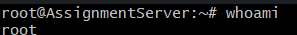

2) **`pwd`** - Print Working Directory. Shows exactly where you are in the file system. Essential for navigating servers without getting lost.

    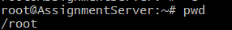

3) **`id herman`** - Shows user ID, group ID and group memberships. Useful for troubleshooting permission issues.

4) **`who`** — Shows who is currently logged into the server. On our shared assignment server, I could see other students logged in at the same time.

    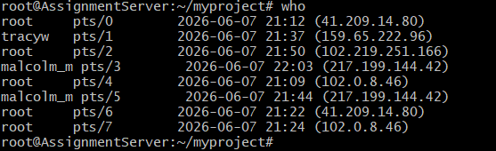

5) **`last | head -10`** - Shows the last 10 login history entries. Useful for auditing who has accessed the server.

    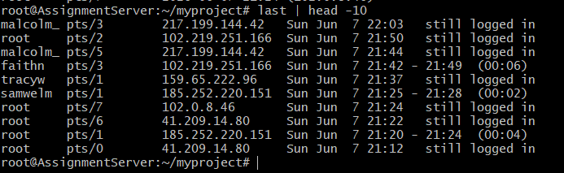
    
### File and Directory Management

6) **`ls -la`** - Lists all files and directories including hidden ones, with detailed information like permissions, size, and timestamps.

    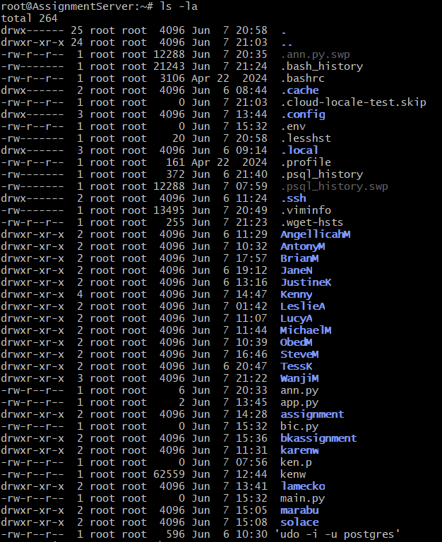

7) **`mkdir ~/myproject`** - Creates a new directory. The `~` means your home directory.

    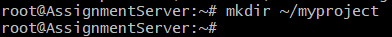

8) **`cd ~/myproject`** - Changes into the myproject directory. Navigation is a fundamental skill.

    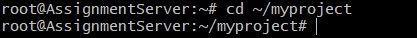

9) **`touch mydata.csv`** - Creates an empty file. Useful for quickly creating placeholder files.

    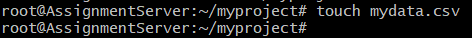

10) **`echo "id,name,department" > mydata.csv`** - Writes text into a file. The `>` overwrites the file and `>>` appends to it.

    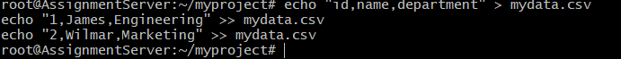

11) **`cat mydata.csv`** - Displays file contents in the terminal.

    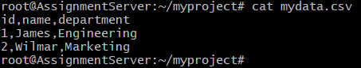

12) **`ls -lh mydata.csv`** - Shows file size in human readable format (KB, MB etc).

    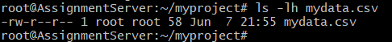

13) **`cp mydata.csv mydata_backup.csv`** - Copies a file. Always good practice to back up files before editing.

    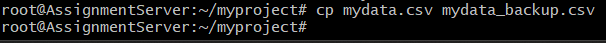

14) **`mv mydata_backup.csv mydata_v2.csv`** - Renames or moves a file.

    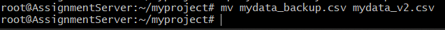

### System Resources

15) **`df -h`** - Shows disk space usage across all mounted drives in human readable format. On our server, the main disk had 77GB total with only 2.7GB used.

    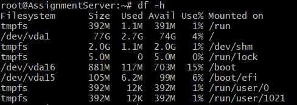

16) **`free -h`** - Shows RAM and swap memory usage. Our server had 3.8GB RAM with only 473MB used, very healthy.

    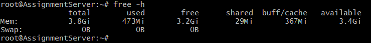

17) **`lscpu`** - Shows detailed CPU information including number of cores, architecture, and virtualization support.

    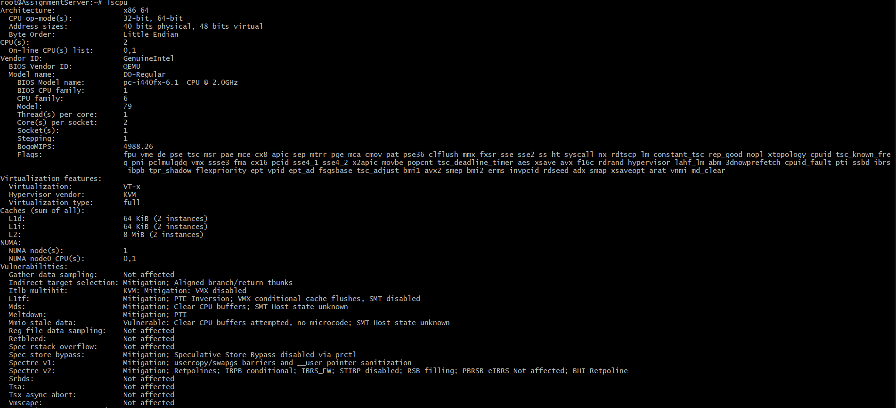

18) **`top -bn1 | head -20`** - Shows a snapshot of running processes sorted by resource usage. The `-bn1` flag runs it once in batch mode instead of interactively.

    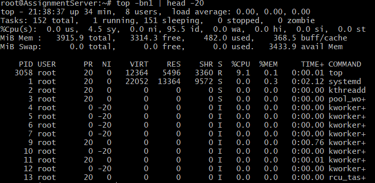

19) **`uptime`** - Shows how long the server has been running and the current load average.

    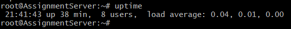

### Networking

20) **`ip addr show`** - Shows all network interfaces and their IP addresses. I could see the server had a public IP (159.65.222.96) and a private IP (10.10.0.8).

    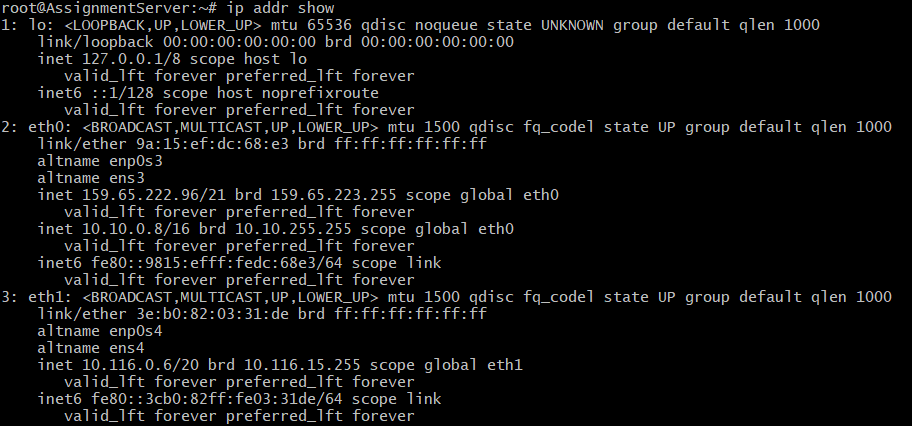

21) **`ss -tulnp`** - Shows all open ports and which services are listening on them. I could confirm PostgreSQL was listening on port 5432 and SSH on port 22.

    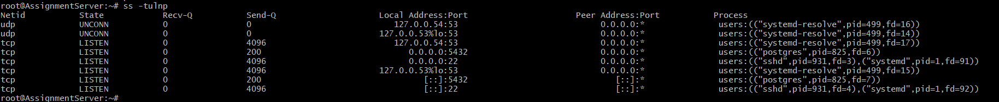
    
### Services and Logs

22) **`systemctl list-units --type=service --state=running`** - Lists all currently running services. I could see PostgreSQL, SSH, and many other services running.

    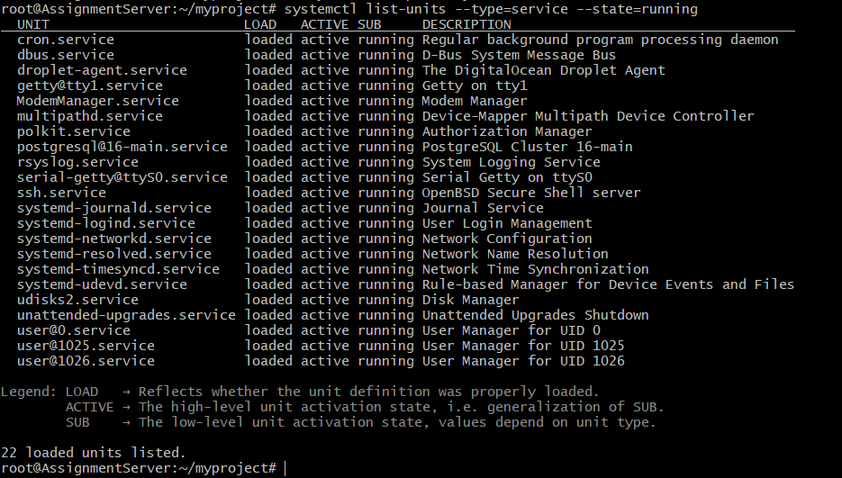

23) **`systemctl status postgresql`** - Shows detailed status of the PostgreSQL service including when it started and recent log entries.

    

24) **`journalctl -n 20`** - Shows the last 20 system log entries. I could see failed SSH login attempts from random IP addresses trying to brute force the server.

    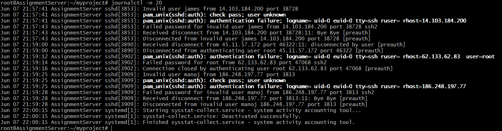

### Environment and Search

25) **`env | head -20`** - Shows environment variables. These include your shell type, home directory, PATH, and other important system settings.

    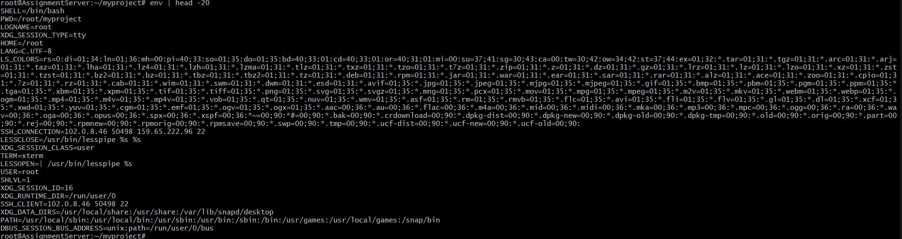

26) **`find / -name "pg_hba.conf" 2>/dev/null`** - Searches the entire filesystem for a file by name. The `2>/dev/null` hides permission error messages. Found the file at `/etc/postgresql/16/main/pg_hba.conf`.

    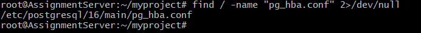

## 6. Transferring Files with SCP
SCP (Secure Copy Protocol) is how you transfer files between your local machine and a remote server. This is extremely useful in data engineering for uploading data files, scripts, and configuration files.

### Upload from Local PC to Server

```bash
scp mydata.csv root@159.65.222.96:/root/myproject/
```

### Download from Server to Local PC

```bash
scp root@159.65.222.96:/root/myproject/mydata.csv ~/Downloads/
```

SCP uses the same SSH security as your normal server connection, so no extra setup is needed. It is one of the most practical tools for moving data around in a data engineering workflow.

## Conclusion 
Working through this assignment gave me a hands-on experience with the tools and workflows that data engineers use every day. Here is a summary of what we covered:

- Connecting to remote servers securely using SSH

- Managing Linux users and understanding permissions

- Installing and configuring PostgreSQL for external access

- Creating databases, schemas, and tables with real sample data

- Running 25 essential Linux commands covering files, networking, processes, and system resources

- Transferring files between local and remote machines using SCP

Modern data infrastructure is based on Linux. From handling cloud databases to running Spark jobs or deploying Airflow pipelines, everything you are doing is going to be on a Linux server. The commands and ideas presented in this article are not just theoretical, they are going to be skills you use on your first day as a data engineer.

I would recommend that if you are learning data engineering you should get your hands dirty and start working with a Linux server. Start out with a low-cost DigitalOcean droplet and practice these commands, and become more confident. The terminal is your most powerful tool, learn to use it well.

## References
Byrone_Code. (2026). *Introduction to Linux for Data Engineers: Mastering the Command Line*. DEV Community. https://dev.to/byrone_code/introduction-to-linux-for-data-engineers-mastering-the-command-line-2dgk
